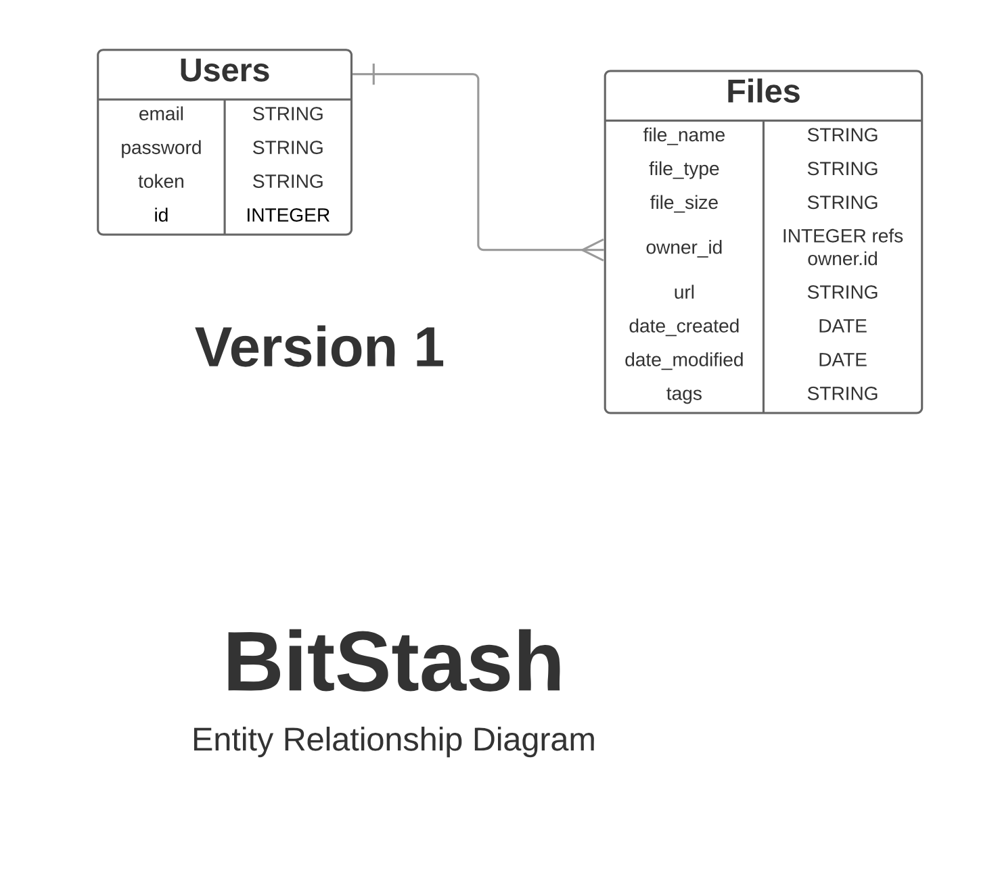

# BitStash API

### Technologies Used:
JavaScript, node.JS, Express, MongoDB, Mongoose, AWS S3

Express Middleware: multer, bcrypt, mime-types, aws-sdk, crypto, path, fs

### Project Links
**Client (Front End) -**
[Deployed Client](https://wbounas.github.io/bitstash-client)
| [GitHub Client Repo](https://github.com/wbounas/bitstash-client)

**API (Back End) -**
[Deployed API](https://wb-bitstash-api.herokuapp.com)
| [GitHub API Repo](https://github.com/wbounas/bitstash-api)

### About
BitStash is an online storage solution that allows you to upload files you have on your personal computer to a remote
server for access from anywhere in the world! Users can create an account, and privately upload personal files of any type
to the cloud, where they can then access them with a web browser.

In this version, we have limited the size of a file upload to 10MB.

This app was created by Fernando Donaire, Ted Cart, Shaun White, and Will Bounas.

### Future Iterations
- Add drag-and-drop functionality when uploading a file
- Allow users to create and edit their own tags for files
- Provide an option to easily copy a link to the shared file on a user's clipboard for simple sharing with friends + family
- Add search functionality for user's files stored on BitStash

## Catalog of Routes

### **API End-Points**

| HTTP Verb | URI Pattern         | Controller#Action |
|--------|------------------------|-------------------|
| post   | `/sign-up`             | `User#signup`    |
| post   | `/sign-in`             | `User#signin`    |
| delete | `/sign-out/:id`        | `User#signout`   |
| patch  | `/change-password/:id` | `User#changepw`  |
| post   | `/files`         | `File#create`  |
| get    | `/files/`        | `File#index` |
| get    | `/files/:id`     | `File#show` |
| delete | `/files/:id`     | `File#destroy` |
| patch  | `/files/:id`     | `File#update` |

## Entity Relationship Diagram

